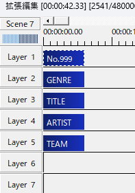
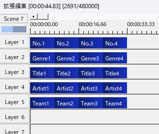
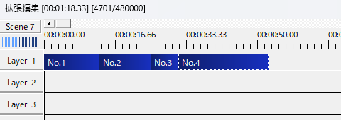
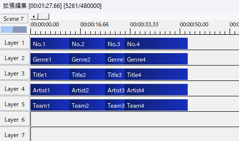

# csvtoexo

csvファイルのデータを元に、aviutlのオブジェクトファイル(exoファイル)を生成します。  
生成には、デザインのテンプレートとなるテキストオブジェクトを配置したオブジェクトファイルも必要です。  
durationオプションでオブジェクトの長さを指定するオブジェクトファイルを設定することもできます。

csvファイルで同じ行のデータは、オブジェクトがグループ化されます。

## Usage
```
csvtoexo [-duration <duration exopath>] <template exopath> <csvpath>
```
- duration: データごとのオブジェクトの長さの元になるexoファイル

## example
**元データ(data.csv)**
```
No.1,Genre1,Title1,Artist1,Team1
No.2,Genre2,Title2,Artist2,Team2
No.3,Genre3,Title3,Artist3,Team3
No.4,Genre4,Title4,Artist4,Team4
```

**テンプレートオブジェクトファイル(template.exo)**

AviUtl拡張編集  
拡張編集画面を右クリック>ファイル>オブジェクトのエクスポートで入手  


AviUtlプレビュー  


テキスト
```
[exedit]
width=1280
height=720
rate=60
scale=1
length=480000
audio_rate=44100
audio_ch=2
[0]
start=1
end=599
layer=1
group=3981
overlay=1
camera=0
...
```

コマンド実行
```
> csvtoexo template.exo data.csv
Finish: output.exo generated.
```

**出力オブジェクトファイル(output.exo)**




### durationオプションでオブジェクトの長さ指定を行う場合

**時間指定オブジェクトファイル(timeline.exo)**



```
> csvtoexo -duration timeline.exo template.exo data.csv
```

**output.exo**

オブジェクトの長さが`timeline.exo`のオブジェクトの長さと同じになる  
